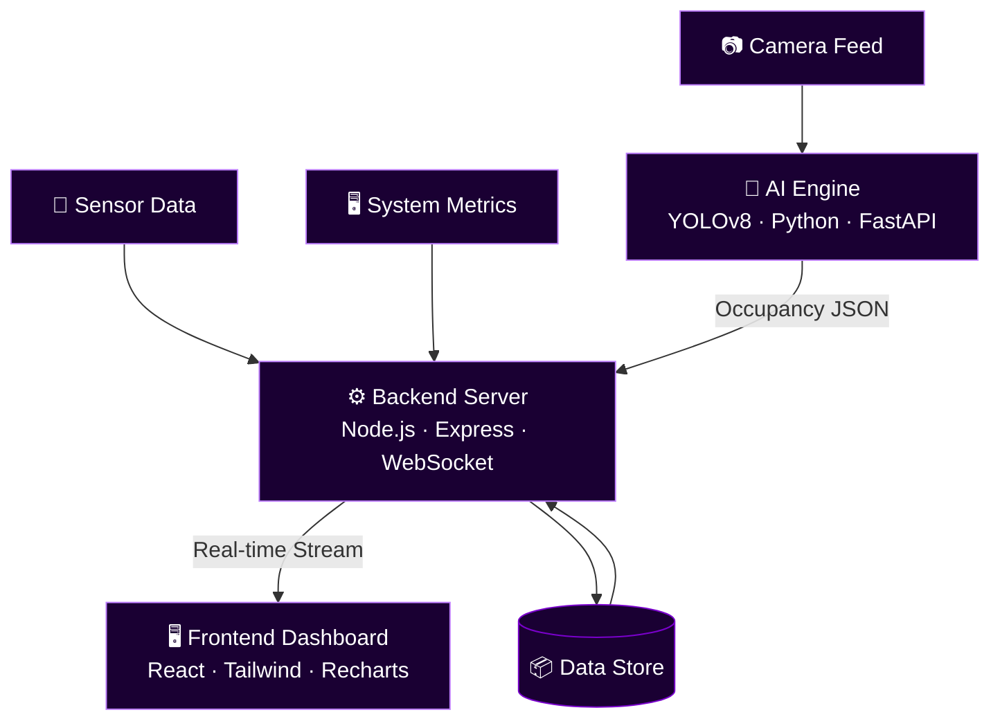

<div align="center">


<br/>

<p align="center">
  
</p>

<br/>

<p align="center">
  
  &nbsp;
  
  &nbsp;
  
  &nbsp;
  
</p>

<p align="center">
  
  
  
  
  
</p>

</div>

---

## What is Mindmesh?

Mindmesh is not just monitoring. It is **awareness at scale**.

Traditional monitoring tools show you numbers. Mindmesh shows you **what's happening** — occupancy, movement, power draw, network load, anomalies — all unified into a single intelligent mesh of perception.

Built for **smart buildings, industrial environments, and next-gen infrastructure** where reactive systems are not enough. Mindmesh makes your environment observable, interpretable, and intelligent.

```
Camera Feeds  ──┐
Sensor Data   ──┤──▶  AI Engine  ──▶  Backend  ──▶  Live Dashboard
System Metrics──┘      (YOLOv8)     (Telemetry)      (React + WS)
```

---

## Core Features

<table>
<tr>
<td width="50%">

### 🤖 AI Vision Engine
- Real-time object detection via **YOLOv8**
- Occupancy tracking across zones
- Movement pattern analysis
- Configurable detection thresholds
- REST API with async inference queue

</td>
<td width="50%">

### ⚡ Grid Intelligence
- Live **power consumption** monitoring
- Network load tracking per node
- System health metrics (CPU, memory, temp)
- Threshold-based alert triggers
- Time-series telemetry history

</td>
</tr>
<tr>
<td width="50%">

### 🎨 Futuristic Interface
- **SmartIsland** dynamic alert overlay
- Quantum-animated background canvas
- Reactive UI with WebSocket live updates
- Dark-first design — built for control rooms
- Mobile-responsive dashboard

</td>
<td width="50%">

### 🐳 Microservice Architecture
- Fully containerized via **Docker Compose**
- Independent AI inference service
- Decoupled backend telemetry engine
- Stateless frontend — deploys anywhere
- Service health checks built-in

</td>
</tr>
</table>

---

## Architecture



---

## Tech Stack

| Layer | Technology | Purpose |
|-------|-----------|---------|
| **AI / Vision** | Python · YOLOv8 · FastAPI · OpenCV | Object detection & occupancy inference |
| **Backend** | Node.js · Express · WebSocket | Telemetry aggregation & data relay |
| **Frontend** | React · Tailwind CSS · Recharts | Live dashboard & visualization |
| **Infra** | Docker · Docker Compose | Service orchestration & isolation |
| **Comms** | WebSocket · REST | Real-time + on-demand data |

---

## Project Structure

```
mindmesh/
│
├── 📁 ai_occupancy_api/          # AI Vision Service (Python)
│   ├── app.py                    # FastAPI entry point
│   ├── detector.py               # YOLOv8 inference engine
│   ├── requirements.txt
│   └── Dockerfile
│
├── 📁 dashboard/
│   ├── 📁 backend/               # Telemetry Engine (Node.js)
│   │   ├── server.js             # Express + WebSocket server
│   │   ├── routes/
│   │   ├── package.json
│   │   └── Dockerfile
│   │
│   └── 📁 frontend/              # Live Dashboard (React)
│       ├── src/
│       │   ├── components/       # SmartIsland, Grid, Vision panels
│       │   ├── hooks/            # useWebSocket, useTelemetry
│       │   └── App.jsx
│       ├── package.json
│       └── Dockerfile
│
├── 📁 docs/                      # Architecture diagrams & API docs
├── docker-compose.yml            # Full stack orchestration
└── README.md
```

---

## Getting Started

> **Prerequisites:** Python 3.10+, Node.js 18+, Docker (optional but recommended)

### 🐳 Option A — Docker (Recommended)

```bash
# Clone the repo
git clone https://github.com/FOX-KNIGHT/mindmesh.git
cd mindmesh

# Spin up all services
docker-compose up --build
```

All three services start automatically. Dashboard available at `http://localhost:3000`.

---

### 🔧 Option B — Manual Setup

**1. AI Vision Engine**

```bash
cd ai_occupancy_api

# Install dependencies
pip install -r requirements.txt

# Start inference server
python app.py
# → Running on http://localhost:8000
```

**2. Backend Telemetry Server**

```bash
cd dashboard/backend

npm install

npm run dev
# → Running on http://localhost:5000
```

**3. Frontend Dashboard**

```bash
cd dashboard/frontend

npm install

npm start
# → Running on http://localhost:3000
```

---

## Service Map

| Service | Port | Description |
|---------|------|-------------|
| `frontend` | `:3000` | React dashboard |
| `backend` | `:5000` | Telemetry API + WebSocket |
| `ai_engine` | `:8000` | YOLOv8 inference REST API |

---

## Roadmap

- [x] YOLOv8 real-time occupancy detection
- [x] Grid telemetry dashboard
- [x] WebSocket live data stream
- [x] Docker Compose full-stack orchestration
- [ ] Multi-camera zone mapping
- [ ] Alerting via webhook / email
- [ ] Historical analytics & replay
- [ ] Edge deployment (Raspberry Pi / Jetson Nano)
- [ ] Auth + role-based access control

---

## Author

<p align="center">
  <a href="https://github.com/FOX-KNIGHT">
    
  </a>
  &nbsp;
  <a href="https://www.linkedin.com/in/siddhant-jena-457350389">
    
  </a>
  &nbsp;
  <a href="mailto:worksiddhant18@gmail.com">
    
  </a>
</p>

---

<div align="center">

> *"See what machines see. Understand what systems feel."*


</div>
